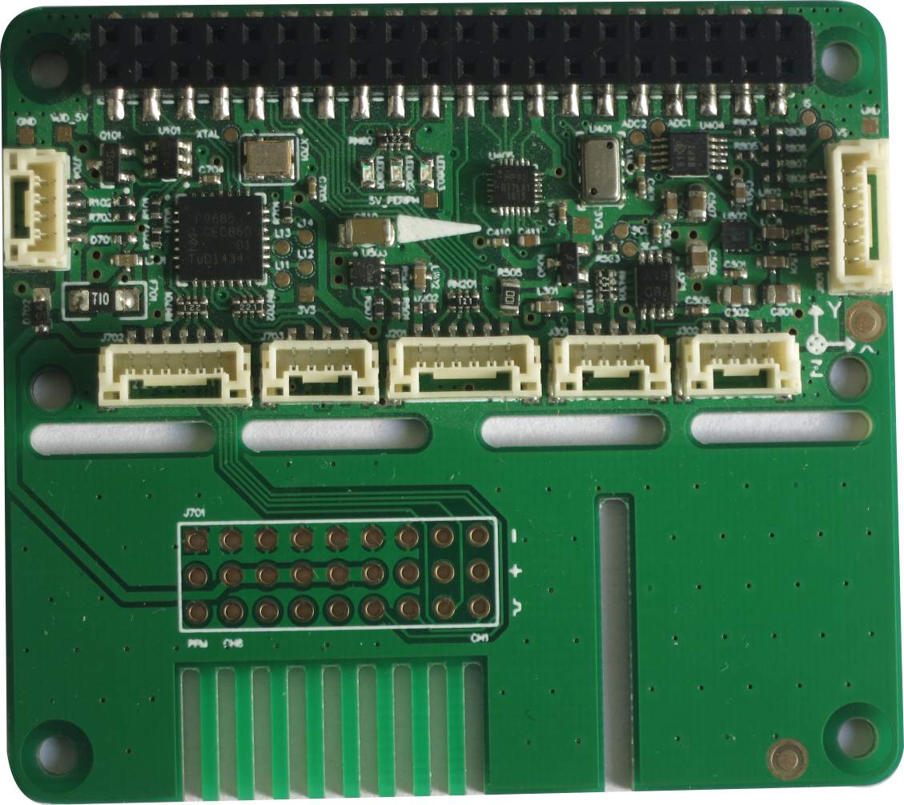
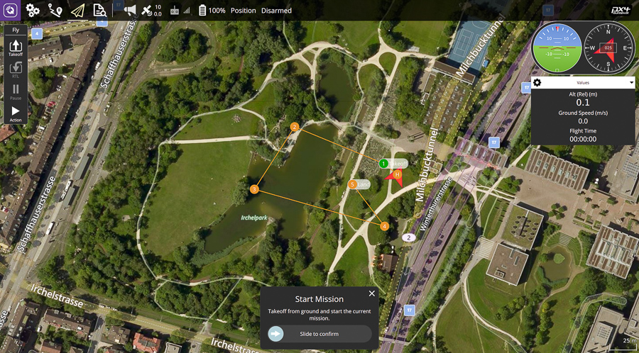
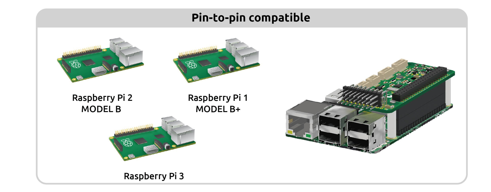
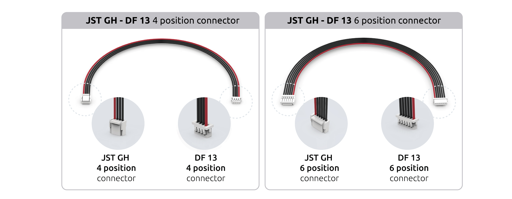
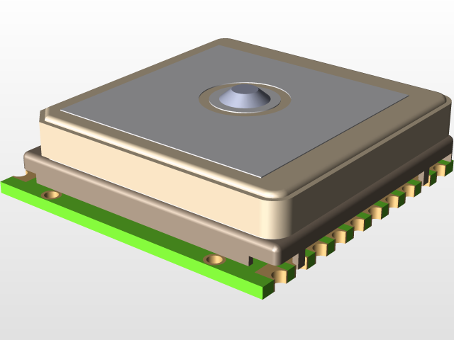

.. _BerryPilot:

Welcome To BerryPilot Documentation 
====================================

We at Hoverbirds have come up with a Autopilot to innovate the new generation of drone developers. We will keep improving our autopilots to help developers to serve them to build more and enhanced robots.

What is BerryPilot?
-------------------
BerryPilot  is a low cost and open autopilot shield for the Raspberry Pi with support for ArduPilot. The shield has been specially designed raspberry Pi but also has compatibility with other pi family.

One Click Configuration
-----------------------
You Only need one click to configure for various next vehicles like Hex-copter, quadcopter, rover and all the compatibility from ardupilot.

+--------------+--------------------+------------+
|              |    BerryPilot      |            |
+==============+========+===========+============+
|PWM Servo Outputs      |    MPU9250 IMU         |
+-----------------------+------------------------+
|PPMSUM input           |   MS5611 Barometer     |
+-----------------------+------------------------+
|POWER module connectors|  PCA 9685 driver       |
+-----------------------+------------------------+
|1xUART,2xI2C extensions| 3 LED Status           |
+-----------------------+------------------------+

Getting Started
================

Attaching the BerryPilot
------------------------
Image

Flashing the Sd-Card
---------------------

Installer for the connecting to Personal Computer
-------------------------------------------------
We have Our customised Q Ground Control installer for the Better Performance of our Auto-Pilot. Please Click here to `download <https://drive.google.com/file/d/1MU-wFV3O92LR2EcBNUmi3FcmFng_hl2S/view?usp=sharing>`_.

Setup Your Vehicle
------------------
First, you need three things, a mouse, a screen and power the Raspilot. The first time you connect the mini PC with a screen, you will see a desktop. You will need to give Internet to the mini PC, open a terminal and install the binary of your desired vehicle. Install our APM Planner/`QGroundcontrol <https://drive.google.com/file/d/1MU-wFV3O92LR2EcBNUmi3FcmFng_hl2S/view?usp=sharing>`_.

Communication
-------------
BerryPilot OS is pre-configured to create an WiFi hotspot in the 5GHz bandwidth, in order to be able of using together 2.4GHz RC and WiFi. The WiFi dongle should be connected before the board is powered on.The WiFi can be used for communicate with the autopilot, transfer files such as logs, plan a mission using a GCS (Ground Control Station), enable video streaming even control the drone.

Micro SD
--------
First at all, remember that you need to make the image flash using software Link.

        .. image:: _images/memory.jpg
HDMI
----
Our Operative System have a GUI, the first time you boot the OS you will see a nice desktop.

PWM
---

Raspilot has 8 channel of PWM output. Each channel has 25 mA current sink capability at 5V. In these channels, the most typical devices that you could connect are: ESCs, servos, gimbal servos,... The PWM can be used for powering the system, refer to Power section.
The top row (~) provides the PWM signal, the center (+) provides 5v and the bottom (-) is the GND signal. Make sure you plug the device connector in the right way.

The next image show which are the PWM channels:

Image

RC INPUT
--------
The radio control Receiver  must be connected in the PPM Sum Input Channel.

Cables
------
Cables for drones with connectors complying with the Ardupilot Connector Standard. The cables make use of the JST GH connectors providing a simplified experience. Hybrid JST GH/DF13 and traditional DF13 cables are also available for backwards compatibility.

Powering the Raspilot
---------------------
Triple redudant power supply Three ways of powering the Raspilot:
    - USB Input
    - Power Module Input
    - Servo rail Input

ADC in Power
----------------
               Notice that the power connector has attached two ADC channels in order to read battery level. If you don't use this connector, you could use the two middle pins to have analog voltage lectures for a sensor/device.

               .. image:: _images/pinconflict.jpeg

Sensing
-------
There are two types of Sensor:
   - Internal Sensor
   - External Sensor

Internal Sensor
---------------

External Sensor
---------------

GPS
---
      
       The Global Positioning System (GPS) is a space-based satellite navigation system that provides location and time information outdoors in all weather conditions, anywhere on the Earth where there is an unobstructed line of sight to six or more GPS satellites.
       The GPS offered by Hoverbirds for the BerryPilot delivers a GNSS engine for GPS/QZSS and GLONASS combining high sensitivity and low power consumption. It requires the following ports: UART (GPS) and I2C (compass). These ports will power up the device.

       
