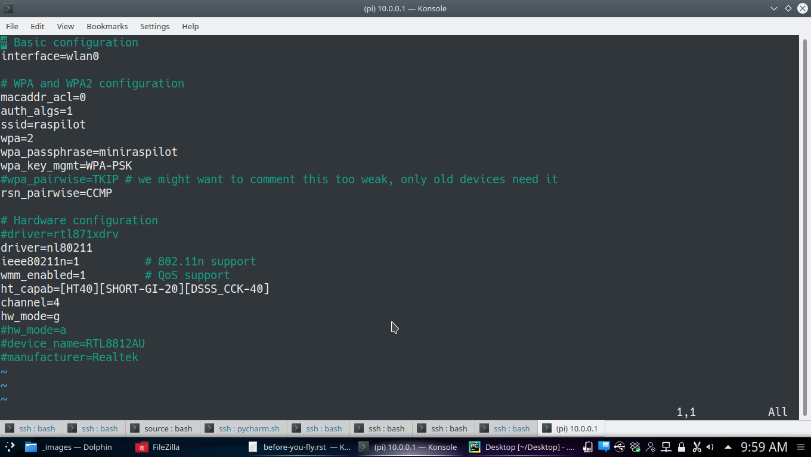

.. _ before-you-fly:

===========================================
Before You Fly
===========================================

Your UAV will come configured to fly. It would have received atleast one flight before being shipped. But there are still a few things about safety, that being doubly sure doesn't hurt. Also the image is not expanded on the card. This is done so that you can take a backup of the card and keep the known working image with you. 

A minimum of following steps need to be followed before you go out to fly

#. Expand the data partition.
#. Change Passwords.
#. Setup failsafes.

Expand the data partition.
=========================
Connect your computer to the UAV's wireless network. Default SSID is "raspilot". The default password is "miniraspilot". Now you can ssh into the Pi using following credentials
    
    IP: 10.0.0.1
    User: pi
    password: raspberry

Once logged in you can use Pi's raspi-config utility to expand the filesystem to fill the whole card. More info about raspi-config is available `here <https://picamera.readthedocs.io/en/release-1.13/>`__

Change Passwords
====================
Once logged in, change the default password to your liking using the Linux utility *passwd*.

The wifi password can be changed from command line by editing file /etc/hostapd/hostapd.conf

The common wifi parameter can also be changd from within QGC at any time `System Control`

Setup failsafes
================
It is very important that you have a minimum of battery and fence failsafe on. Otherwise you risk loosing your vehicle in fly away kind of situation. GCS and GPS failsafes are also good to have.

.. image:: _images/qgc_failsafe_screen.png
    :target: _images/qgc_failsafe_screen.png
