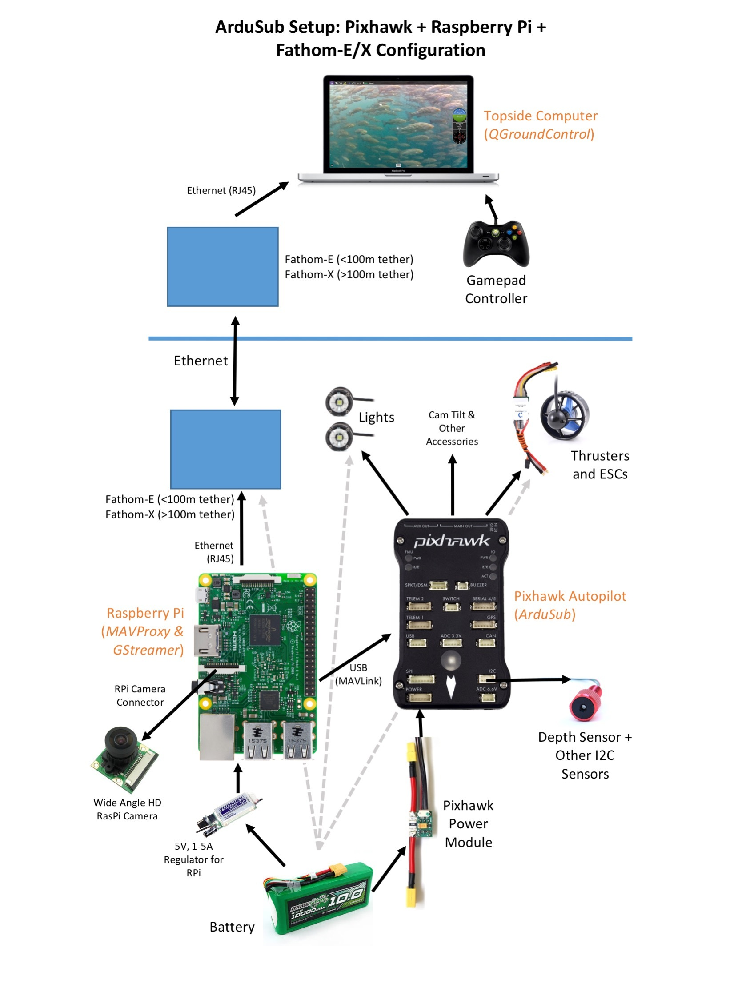

.. _Intruduction:

===========================================
Introduction
===========================================

Hoverbird's RW460 copter and FW800 plane are based on the following open source projects. In fact most of the functionality is provided by these projects which a few things added on top for making it affordable and playful for the student builders.

#. `Ardupilot <http://ardupilot.org/>`__ with documentation `here <http://ardupilot.org/ardupilot/index.html>`__

#. `QGroundControl <http://qgroundcontrol.com/>`__ with User Guide `here <https://docs.qgroundcontrol.com/en/>`__ and developer guide `here <https://dev.qgroundcontrol.com/en/>`__.

#.  MavProxy with documentation `here <http://ardupilot.github.io/MAVProxy/html/index.html>`__.

These are excellent projects with excellent up to date documentation. Here we document only things that are specific to our products. For rest of the documentation, you should refer to these projects directly.
Whole source code is available, both in the raspberry pi images as well as on GitHub. The control interface provided is http so that the students can play with various options for camera as well other commands by simply using a browser or commands like wget. If they wish they can later integrate their custom commands into QGC.

Added Features
===================

Most of the specific features are added through raspberry pi as Companion computer and adding corresponding options to QGC.

#. Raspberry Pi cam support.

#. Hostspot on the copter with controls in QGC.

#. System control in QGC for clean shutdown.

#. Additional Joystick options.

#. Fixed end point ESCs.

Connecting Diagram
==============================

.. _raspberry-pi-via-mavlink_setup_the_rpi:

Setup the RPi
=========================================

We are currently not providing image download link as it is quite large and we don't really have bandwidth. For the time being you have to order a preformatted card or share your email address, we will send you the latest link.
