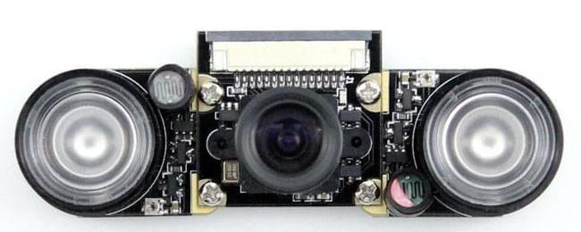

.. _raspberry-pi-cam-mods:

===========================================
Raspberry Pi Camera Mods
===========================================

Raspberry Pi camera is quite easy to modify both in software and hardware. We will only discuss hardware mods here.  

#. Regular camera with white light LEDs
#. NOIR camera with IR LEDs
#. camer with switable IR filter

Regular camera with while light LEDs
=====================================
You can use regular Pi camera module with white light LEDs to illuminate object in the night. But if stealth is desired, you are better off using NOIR camera with IR Leds.

NOIR camera with IR LEDs
=========================
If you don't want the lights to be visible to human eye in the night IR LEDs couples with NOIR camera will do the job. 

The image becomes more like monochrome but visibility is much better

.. image:: http://www.arducam.com/wp-content/uploads/2017/08/capture_2-1.jpg

Switable IR filter
=========================
All camera sensors are capable of capturing light far into IR spectrum. This changes the color of an image that looks different unnatural to human eye. To avoid the problem, all camera put a IR blocking filter infront of the sessor. But for low light or IR based night vision capabilities it is sometime better to have the flexibility to switch the filter electornically. Insert when there is sufficent light and remove when there is low light or object is IR Led illuminated. 

The following modules provides that capability. we will also come up with a module that has zoom built in.

    

