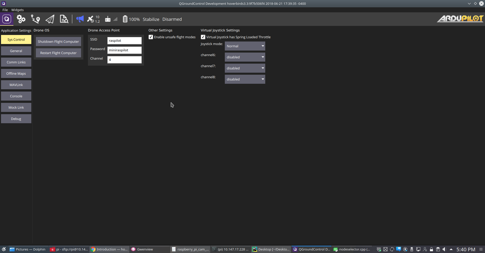

.. _system-control:

========================
System Control
========================

This is our own corner in QGC settings that is specific to the image that we run on Companion computer. We decided to bunch all these settings together in a separate screen, so that it is relatively easy to merge with upstream QGC.

Companion OS Control
======================
First group with heading 'Drone OS'__ is primarily meant to shut down or restart Raspberry Pi cleanly. These two operations always ask for confirmation as they can be dangerous if done in flight. These were necessary because if you just power cycle the Pi, you will corrupt the SD card sooner than later. 

Wifi Hotspot Control
======================
Our image creates a hotspot on the vehicle. Any device that wants to interact with the vehicle has to connect to this hotspot. You can connect multiple devices but only one should run QGC. 

The hotspot is also handy as a portable mobile tower in places where there is no coverage. A copter rising up 100m or 200m above ground can get good cell signal. Then it can beam it down to wifi connected devices on the ground. If you are in a urban area it might be worthwhile to choose a different channel based on your local interference pattern.

The hotspot settings allow you to change the name of your network as well as password. These settings take effect after a restart.

The settings also allow you set the channel. This can be very handy in order to avoid dance wifi areas where the current channel may have too much interference and thus poor bandwidth. You can use android utility like `Wifi Analyzer <https://play.google.com/store/apps/details?id=com.farproc.wifi.analyzer&hl=en_US>`__ to find the best channel (most free channel).

Using external Wifi for additional range
=========================================

Enable Unsafe Modes:
=====================
As our platform is intended to be usable with only virtual joystick, this checkbox is provided to disable unsafe flight modes like stabilize, acro, sports etc. You should never fly copter without an actual RC in these manual modes of Ardupilot operation. Joysticks generally don't have enough tactical feedback required to operate these modes. Please go through mode documentation carefully on ardupilot wiki before engaging it. With flying things you shouldn’t really skip on reading before playing around with them.
